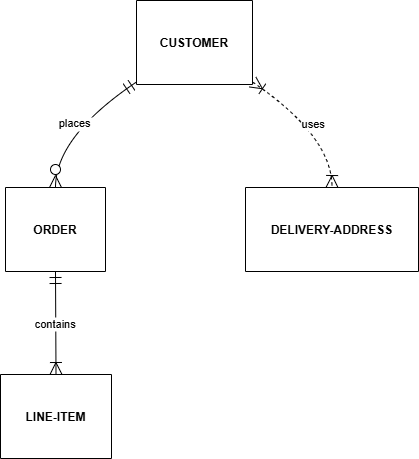

# requirement-analysis

## What is Requirement Analysis?

**Requirement Analysis** is a crucial phase in the Software Development Lifecycle (SDLC) that involves gathering, evaluating, and documenting the needs and expectations of stakeholders for a software project. This process serves as the foundation for designing, developing, and delivering a product that meets user and business needs.

## Why is Requirement Analysis Important?

Requirement Analysis plays a key role in ensuring project success by:

- **Understanding User Needs**: It helps identify what users truly need from the software, avoiding assumptions or misinterpretations.
- **Defining Clear Objectives**: It sets clear, measurable goals for the project, guiding the development team.
- **Reducing Risks**: By clarifying requirements early, it minimizes the chances of costly changes or project failure later.
- **Improving Communication**: It acts as a common reference point between stakeholders, developers, designers, and testers.
- **Enabling Better Planning**: Accurate requirements support effective resource allocation, scheduling, and budgeting.

## Key Activities in Requirement Analysis

- **Requirement Gathering**: Collecting information from all stakeholders to understand their needs, expectations, and constraints.
- **Requirement Elicitation**: Using techniques like interviews, questionnaires, user observation, and workshops to draw out the actual requirements from stakeholders.
- **Requirement Documentation**: Clearly recording the requirements in a structured format such as a Software Requirements Specification (SRS) document for future reference.
- **Requirement Analysis and Modeling**: Analyzing the gathered requirements to resolve conflicts, identify dependencies, and model them using tools like flowcharts, data flow diagrams, or use case diagrams.
- **Requirement Validation**: Ensuring that the documented requirements are complete, clear, feasible, and aligned with stakeholder needs before proceeding to the design phase.

### Types of Requirements

- **Functional Requirements**: What the system should do (e.g., user authentication, data processing).  
- **Non-Functional Requirements**: How the system should perform (e.g., performance, security, usability).

## Use Case Diagrams
Use Case Diagrams are a type of behavioral diagram in UML (Unified Modeling Language) that visually represent the interactions between users (actors) and a system. They help to capture the functional requirements of a system by showing the different ways users can interact with it through various use cases.

### Benefits of Use Case Diagrams

- Provide a clear, visual overview of system functionality.

- Help stakeholders and developers understand system requirements.

- Facilitate communication between technical and non-technical team members.

- Serve as a foundation for creating detailed test cases and design specifications.

### Booking System Use Case Diagram

## Acceptance Criteria

### What is Acceptance Criteria?

Acceptance Criteria are a set of conditions that a software product must satisfy to be accepted by a user, customer, or other stakeholders. They are used to define the boundaries and expected behavior of a feature or user story, ensuring everyone involved has a clear understanding of what "done" means.

### Importance in Requirement Analysis

- **Clarifies Requirements**: Helps developers and stakeholders agree on what a feature should do.
- **Prevents Misunderstandings**: Reduces ambiguity by providing clear, testable statements.
- **Guides Development & Testing**: Acts as a reference for developers and QA teams to ensure proper implementation and verification.
- **Enables Acceptance Testing**: Serves as the basis for user acceptance testing (UAT).

### Example: Acceptance Criteria for Checkout Feature

**Feature**: Checkout functionality in the Booking Management System

**Acceptance Criteria:**
1. ✅ User must be able to view a summary of selected bookings before proceeding to payment.
2. ✅ The system must validate payment information before processing.
3. ✅ If the payment is successful, a booking confirmation page should be displayed.
4. ✅ An email confirmation must be sent to the user after a successful checkout.
5. ✅ The system must prevent checkout if no items are in the cart.
